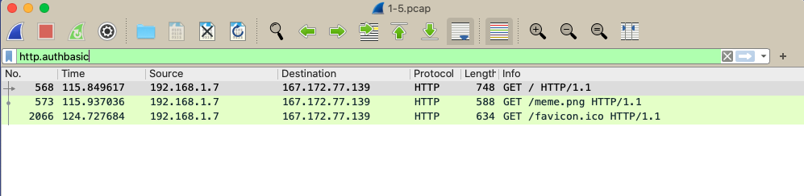
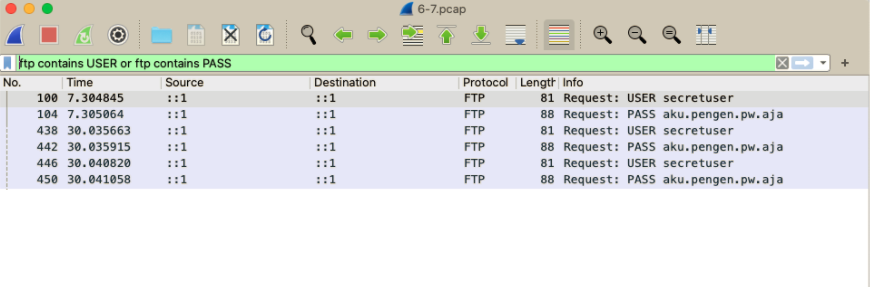
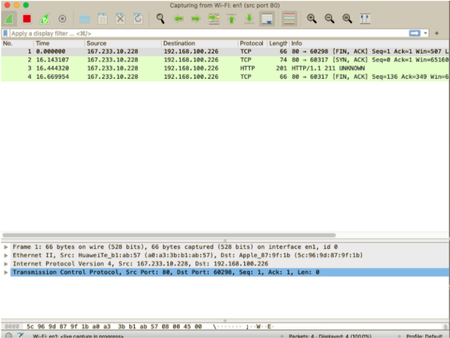
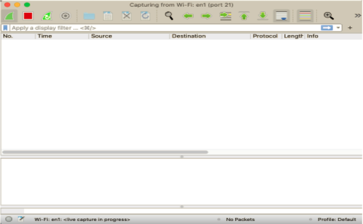
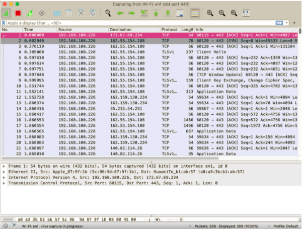
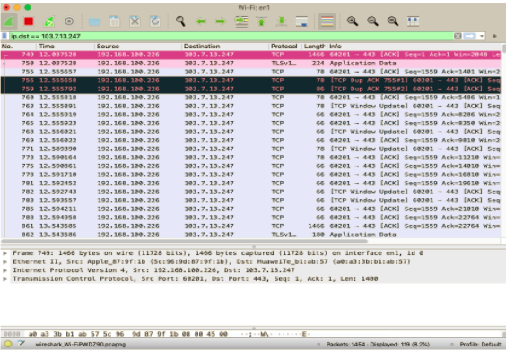
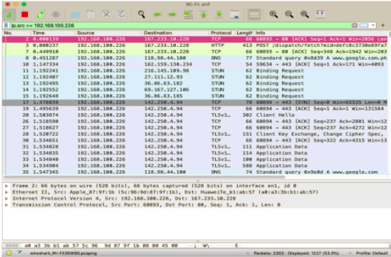

# Jarkom-Modul-1-D08-2021

## Soal No 1
Sebutkan webserver yang digunakan pada "ichimarumaru.tech"! 

Untuk mengetahui server yang digunakan dalam web ichimarumaru.txt ialah dengan melakukann filter  ``host ichimarumaru.tech`` kemudia menggunakan display filter ``http.host==ichimarumaru.tech``. Setelah itu memmbuka analyze kemudia ke follow dan dibagian http stream akan tertera server dari ichimarumaru.tech yaitu `nginx/1.18.0 (Ubuntu)`

## Soal No 2
Temukan paket dari web-web yang menggunakan basic authentication method!

## Soal No 3
Ikuti perintah di basic.ichimarumaru.tech! Username dan password bisa didapatkan dari file .pcapng!

## Soal No 4
Temukan paket mysql yang mengandung perintah query select!

## Soal No 5
Login ke portal.ichimarumaru.tech kemudian ikuti perintahnya! Username dan password bisa didapat dari query insert pada table users dari file .pcap!

## Soal No 6
Cari username dan password ketika melakukan login ke FTP Server!

## Soal No 7
Ada 500 file zip yang disimpan ke FTP Server dengan nama 0.zip, 1.zip, 2.zip, ..., 499.zip. Simpan dan Buka file pdf tersebut. (Hint = nama pdf-nya "Real.pdf")

## Soal No 8
Cari paket yang menunjukan pengambilan file dari FTP tersebut!

## Soal No 9
Dari paket-paket yang menuju FTP terdapat inidkasi penyimpanan beberapa file. Salah satunya adalah sebuah file berisi data rahasia dengan nama "secret.zip". Simpan dan buka file tersebut!

## Soal No 10
Selain itu terdapat "history.txt" yang kemungkinan berisi history bash server tersebut! Gunakan isi dari "history.txt" untuk menemukan password untuk membuka file rahasia yang ada di "secret.zip"!

Berdasarkan file 8-10.pcap yang ada pada soal, maka dapat dicari history.txt dengan menggunakan display filter ``ftp-data contains "history"``.
Setelah itu pada bagian line-based text data terdapat file bernama bukanapaapa.txt.

Dengan mencari di display filter ``ftp-data contains "bukanapaapa"`` maka didapatkan password yang terletak pada line-based text data yaitu `d1b1langbukanapaapajugagapercaya`

## Soal No 11
Filter sehingga wireshark hanya mengambil paket yang berasal dari port 80! 

## Soal No12
Filter sehingga wireshark hanya mengambil paket yang mengandung port 21!

## Soal No 13
Filter sehingga wireshark hanya menampilkan paket yang menuju port 443!

## Soal No 14
Filter sehingga wireshark hanya mengambil paket yang tujuannya ke kemenag.go.id!

## Soal No 15
Filter sehingga wireshark hanya mengambil paket yang berasal dari ip kalian!

